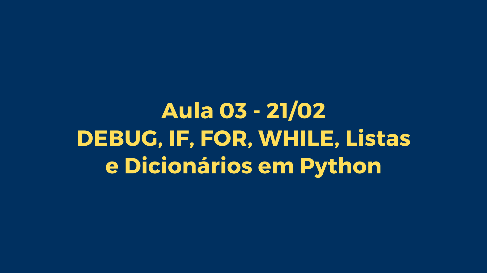

Aula 03: DEBUG, IF, FOR, While, Listas e Dicionários em Python

Bem-vindo à terceira aula do bootcamp!

Hoje, vamos explorar estruturas de controle de fluxo como if, for, e while.

Usamos estrutura de Controle de Fluxo para tomar decisões!

Airflow principal ferramenta de workflow imagem_07

Estruturas de Controle de Fluxo
Exploraremos como utilizar if para tomar decisões baseadas em condições, for para iterar sobre sequências de dados, e while para executar blocos de código enquanto uma condição for verdadeira.

Para saber mais: https://docs.python.org/pt-br/3/tutorial/controlflow.html

Estruturas de Controle de Fluxo
O if é uma estrutura condicional fundamental em Python que avalia se uma condição é verdadeira (True) e, se for, executa um bloco de código. Se a condição inicial não for verdadeira, você pode usar elif (else if) para verificar condições adicionais, e else para executar um bloco de código quando nenhuma das condições anteriores for verdadeira.

Provavelmente o mais conhecido comando de controle de fluxo é o if. Por exemplo:

x = int(input("Please enter an integer: "))

if x < 0:
    x = 0
    print('Negative changed to zero')
elif x == 0:
    print('Zero')
elif x == 1:
    print('Single')
else:
    print('More')

FOR
O loop for é utilizado para iterar sobre os itens de qualquer sequência, como listas, strings, ou objetos de dicionário, e executar um bloco de código para cada item. É especialmente útil quando você precisa executar uma operação para cada elemento de uma coleção.

O comando for em Python é um pouco diferente do que costuma ser em C ou Pascal. Ao invés de sempre iterar sobre uma progressão aritmética de números (como no Pascal), ou permitir ao usuário definir o passo de iteração e a condição de parada (como C), o comando for do Python itera sobre os itens de qualquer sequência (seja uma lista ou uma string), na ordem que aparecem na sequência. Por exemplo:

# Measure some strings:
words = ['cat', 'window', 'defenestrate']
for w in words:
    print(w, len(w))
# Measure some strings:
nome = ['Luciano']
for letra in nome:
    print(letra)
Se você precisa iterar sobre sequências numéricas, a função embutida range() é a resposta. Ela gera progressões aritméticas:

for i in range(5):
    print(i)
O ponto de parada fornecido nunca é incluído na lista; range(10) gera uma lista com 10 valores, exatamente os índices válidos para uma sequência de comprimento 10. É possível iniciar o intervalo com outro número, ou alterar a razão da progressão (inclusive com passo negativo):

list(range(5, 10))
[5, 6, 7, 8, 9]

list(range(0, 10, 3))
[0, 3, 6, 9]

list(range(-10, -100, -30))
[-10, -40, -70]
Para iterar sobre os índices de uma sequência, combine range() e len() da seguinte forma:

a = ['Mary', 'had', 'a', 'little', 'lamb']
for i in range(len(a)):
    print(i, a[i])

Exercícios com WHILE
O loop while é uma estrutura de controle de fluxo fundamental em Python, permitindo executar um bloco de código repetidamente enquanto uma condição especificada é avaliada como verdadeira (True). Na engenharia de dados, o uso do while pode ser extremamente útil para diversas tarefas, como monitoramento contínuo de fontes de dados, execução de processos de ETL (Extract, Transform, Load) até que não haja mais dados para processar, ou mesmo para implementar tentativas de reconexão automáticas a serviços ou bancos de dados quando a primeira tentativa falha.

Exemplo de Uso do while em Engenharia de Dados
Um cenário comum em engenharia de dados é a necessidade de executar uma tarefa de maneira periódica, como verificar novos dados em um diretório, fazer polling de uma API para novas respostas ou monitorar mudanças em um banco de dados. Nestes casos, um loop while pode ser utilizado para manter o script rodando continuamente ou até que uma condição específica seja atingida (por exemplo, um sinal para desligar ou uma condição de erro).

Exemplo Prático: while True com Pausa
Um exemplo direto do uso de while True em Python é criar um loop infinito que executa uma ação a cada intervalo definido, como imprimir uma mensagem a cada 10 segundos. Isso pode ser útil para monitorar processos ou dados em tempo real com uma verificação periódica.

import time

while True:
    print("Verificando novos dados...")
    Aqui você pode adicionar o código para verificar novos dados,
    por exemplo, checar a existência de novos arquivos em um diretório,
    fazer uma consulta a um banco de dados ou API, etc.
    
    time.sleep(10)  # Pausa o loop por 10 segundos
Neste exemplo, o while True cria um loop infinito, que é uma maneira poderosa de manter um script rodando continuamente. O print simula a ação de verificar novos dados, e o time.sleep(10) pausa a execução do loop por 10 segundos antes da próxima iteração. Essa abordagem é simples, mas eficaz para muitos cenários de monitoramento e polling em engenharia de dados, permitindo que o script execute uma verificação ou tarefa de maneira periódica.

Contudo, é importante usar loops infinitos com cautela para evitar criar condições em que o script possa consumir recursos desnecessários ou tornar-se difícil de encerrar de forma controlada. Em ambientes de produção, outras abordagens como agendamento de tarefas (por exemplo, usando cron jobs em sistemas Unix) ou o uso de sistemas de enfileiramento de mensagens e triggers de banco de dados podem ser mais adequados para algumas dessas tarefas.